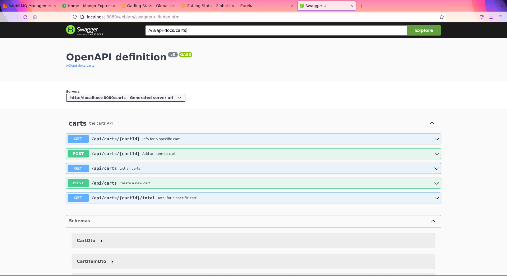
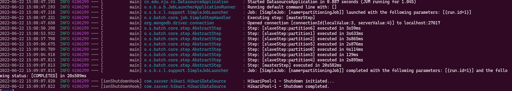
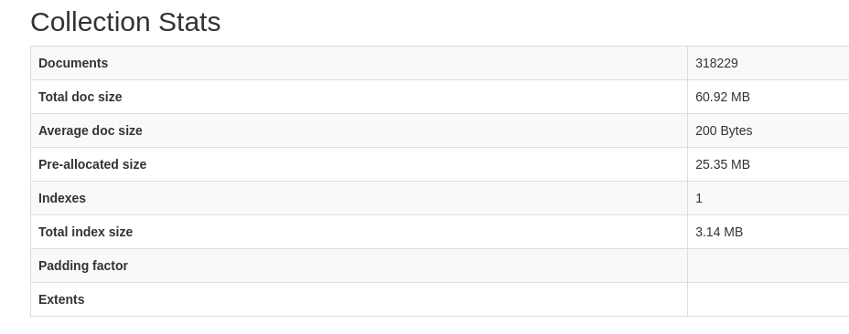
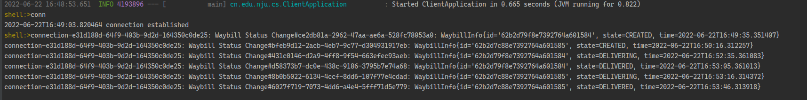
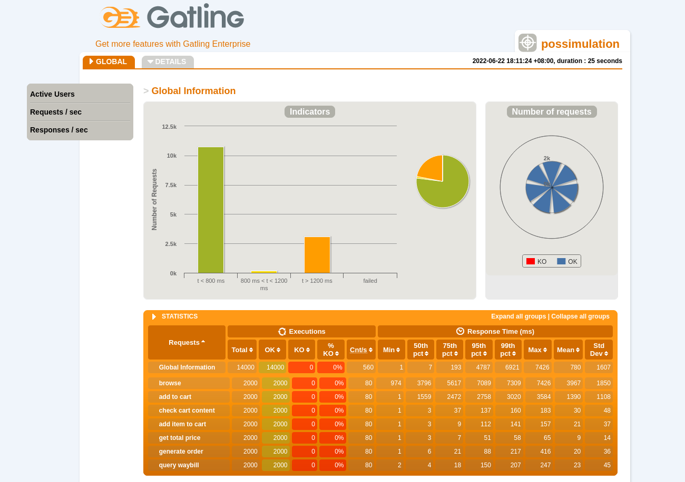
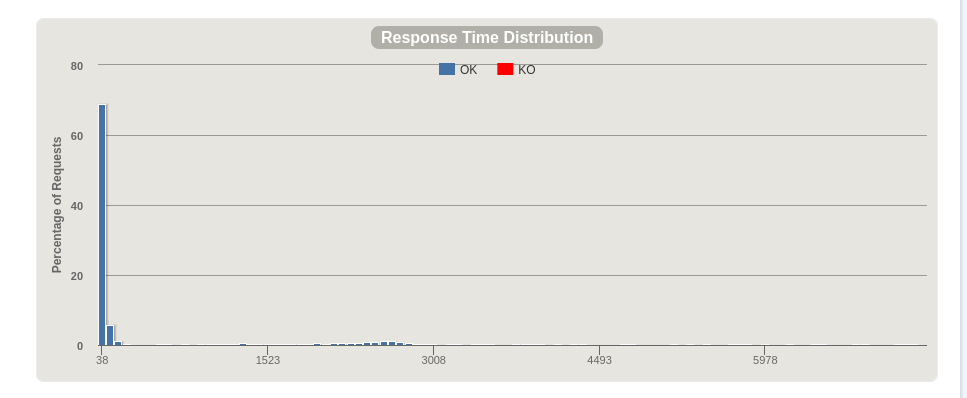
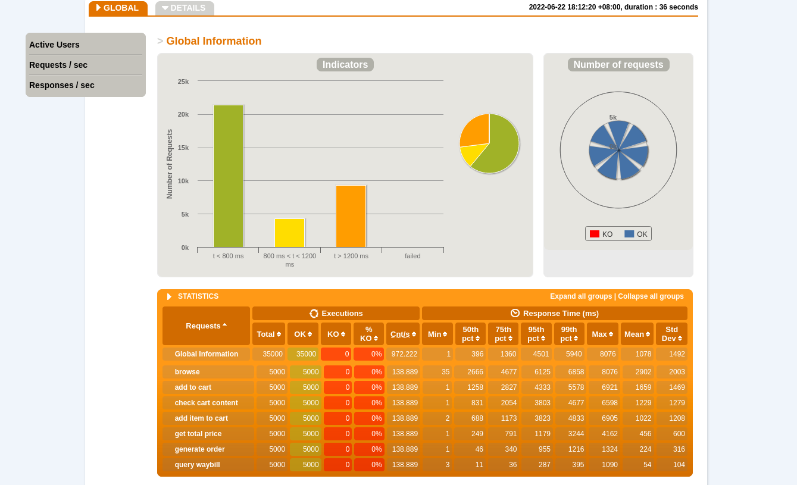
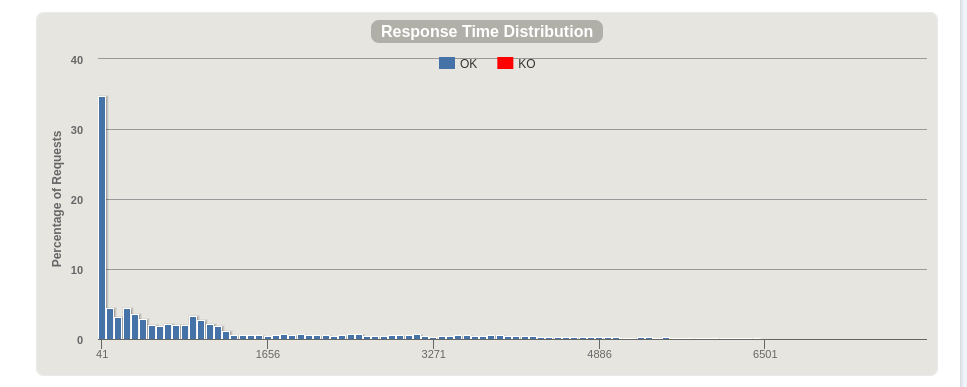
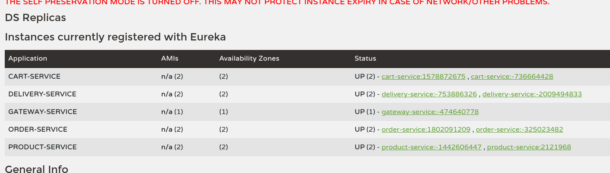

# 反应式在线购物系统

## 构建与运行

本次作业分为四个主要模块，均基于 maven 工具进行构建，使用的 JDK 版本为 JDK 11，整体构建运行流程为

### 启动数据库和消息队列服务

进入 `docker-compose` 目录，运行

```bash
docker-compose -f docker-compose.yml up -d
```

启动应用所依赖的服务，包括消息队列中间件 rabbitmq，非关系型数据库 mongodb 以及 mongodb 的控制台 mongodb express。启动完成后可在浏览器中访问 `http://localhost:18081` 和 `http://localhost:15672` 查看服务是否正确启动

### 数据导入模块

进入 `pos-datasource` 目录，运行

```bash
mvn spring-boot:run
```

这个 spring boot 应用会将 `resources/data` 目录下的来自 Amazon 的商品元数据导入到数据库中（json 文件格式），具体细节将在后文介绍。在不重新生成 docker 容器的情况下该步只要运行一次即可

### 在线购物系统模块

启动 `pos-discovery` 服务，然后启动 `pos-gateway/pos-carts/pos-order/pos-product/pos-delivery` 服务，使用编译好的 jar 包或 `mvn spring-boot:run` 均可。随后即可访问 `http:localhost:8080/swagger-ui.html` 查看定义的接口文档。在顶部输入栏中输入 `v3/api-docs/{service-name}` 即可查看各个服务定义的接口，这里的 `service-name` 包括

* `products`
* `carts`
* `orders`
* `waybills`

效果如图



### 消息订阅客户端模块

`pos-client` 应用是基于 spring shell 的客户端应用，用于接受来自服务器的消息推送，获取订单状态。运行方法为启动后输入 `conn` 即可建立起与服务器的连接，而输入 `dis` 即可断开连接。具体细节将在后文详解

### 测试模块

`pos-test` 则是用于压力测试的 gatling 项目，在目录下运行

```bash
mvn gatling:test
```

即可进行测试并生成测试报告

## 数据导入模块

本模块代码位于根目录下的 `pos-datasource` 目录中。该模块承接自 aw06，使用 spring batch 进行批处理读取 json 文件，解析内容并写入数据库。由于本次的在线购物系统为纯反应式，数据持久化方案选择支持反应式的 mongodb，因此将 aw06 中写入 mysql 数据库的 ItemWriter 更换为写入 mongodb，经过测试在每次批量写入 10000 条数据的情况下处理约 60 万条数据只需要 20 秒



在处理时筛去了价格为空的记录，最终存入数据库的记录为 31 万条



## 在线购物模块

该部分模块承接自 aw09，使用微服务架构组织在线购物系统，整个系统可以分为六个服务，包括

* 微服务注册与发现服务：pos-discovery
* 网关服务：pos-gateway
* 实现具体业务功能的服务
    * 商品服务：pos-product
    * 购物车服务：pos-cart
    * 订单服务：pos-order
    * 运单服务：pos-delivery

注册与发现服务是一个 eureka 服务器实现，该服务需要最先启动以使得其他微服务可以发现并注册。启动后可以访问 `http://localhost:8761` 查看控制面板

网关服务主要实现路由功能。在该模块中根据用户输入的路径，将请求转发到带有负载均衡的服务域名（e.g. `lb://product-service`）。该模块除了定义对四个业务服务的路由以外，还定义了对 `/v3/api-docs/**` 的路由，这样在用户访问网关的 swagger-ui 并填写 `/v3/api-docs/{service-name}` 后网关便会将请求重写为 `{service-name}/v3/api-docs`，然后再根据之前定义的路由将请求转发到具体的 service 上，实现通过网关集成各个子服务的 api 文档。整个系统也只向外界暴露网关作为接口，内部的服务每次启动都是随机选择可用端口

商品服务提供了商品的浏览功能。由于数据库内商品条目众多，因此我们在查询所有商品时提供了两个可选的参数。page 指定需要查询的页码，默认每页返回 10 条记录，不指定该参数的情况下默认返回第一页；name 指定查询关键字，如果该参数不为空则根据关键字对商品名进行模糊查询（类似 SQL 中的 `LIKE '%KEYWORD%'`），两个参数可以组合使用

购物车服务则可以进行创建购物车，查询购物车，添加商品，查询总价等操作。具体可以参见 api 文档

订单服务则实现了根据购物车中内容生成订单的功能，具体可参见 api 文档。订单服务在生成订单后会通过消息队列向运单服务发送订单号，而运单服务在收到消息后则自动生成对应的运单

运单服务可以查询运单的状态，同样支持查询所有运单和根据订单 id 模糊查询运单，具体可以参见 api 文档。运单服务并不支持手动创建运单，只能通过来自订单服务的消息生成订单。运单服务提供两套接口，`api` 接口下的是正常的 rest 服务，而 `query` 接口下提供对消息流的订阅，可以实时接收运单的状态变化。这部分的实现使用了 spring 的 sse（server sent event）机制。首先我们定义了一个简单的 publisher 和 subscriber 接口，subscriber 可以将自身注册至 publisher，然后接收来自 publisher 的消息。我们在应用中定义了一个 publisher 的 bean，在收到来自订单服务的消息时，消息处理函数会生成一条运单记录，同时通过 publisher 发布运单创建的消息，随后通过 spring 的 TaskScheduler 机制，注册两个在一定延时后运行的任务，两个任务分别修改订单的状态，然后通过 publisher 发布状态改变的消息，核心代码如下

```java
@Bean
public Consumer<OrderDto> generateWaybill() {
    return d -> waybillRepository.save(new Waybill(d.getId())).subscribe(waybill -> {
        var id = waybill.getId();
        // publish waybill created
        publisher.publish(new WaybillInfo(waybill.getId(), waybill.getState(), LocalDateTime.now()));


        // start two scheduled task
        scheduler.schedule(() -> waybillRepository.findById(id)
                           .flatMap(wb -> {
                               wb.setState(Waybill.State.DELIVERING);
                               return waybillRepository.save(wb);
                           })
                           .subscribe(wb -> publisher.publish(new WaybillInfo(wb.getId(), wb.getState(), LocalDateTime.now()))), LocalDateTime.now().plusSeconds(DELIVERING_DELAY).atZone(TimeZone.getDefault().toZoneId()).toInstant());

        scheduler.schedule(() -> waybillRepository.findById(id)
                           .flatMap(wb -> {
                               wb.setState(Waybill.State.DELIVERED);
                               return waybillRepository.save(wb);
                           })
                           .subscribe(wb -> publisher.publish(new WaybillInfo(wb.getId(), wb.getState(), LocalDateTime.now()))), LocalDateTime.now().plusSeconds(DELIVERING_DELAY + DELIVERED_DELAY).atZone(TimeZone.getDefault().toZoneId()).toInstant());
    });
}
```

随后定义一个 Flux，将其与 publisher 连接起来

```java
messageFLux = Flux.<WaybillInfo>create(sink -> {
    publisher.subscribe(new MessageListener() {
        @Override
        public void onNext(WaybillInfo info) {
            sink.next(info);
        }

        @Override
        public void onComplete() {
            sink.complete();
        }
    });
}).publish();
messageFLux.connect();
```

然后通过 publish 将其变为一个 hot 的 Flux（不需要订阅也可以发送数据，后订阅的 subscriber 将只获得订阅之后发布的消息），再通过 connect 启动该流。随后 controller 只需返回 `Flux<ServerSentEvent<String>>` 即可

```java
@GetMapping("waybills")
public Flux<ServerSentEvent<String>> getMessage() {
    return Flux.from(messageFLux)
        .map(QueryController::buildEvent);
}
```

如何消费该流则将在下一节详述

由此我们实现了一个 fully functional 的在线购物系统，支持从浏览商品到结账下单的完整流程

## 消息订阅模块

该模块使用 spring shell 实现，代码位于 `pos-client` 目录下。该模块可以订阅前文中提到的 sse 流，其使用同样来自 webflux 项目的 `WebClient` 消费服务，并将接收到的消息打印至控制台。关键代码如下

```java
var connection = client
    .get()
    .uri("/waybills/query/waybills")
    .retrieve()
    .bodyToFlux(type)
    .subscribe(event -> System.out.printf("connection-%s: %s#%s: %s\n", uuid, event.event(), event.id(), event.data()));
    return String.format("%s connection established", LocalDateTime.now());
```

这里的代码只是生成了一个流，随后便返回，该流可以以异步非阻塞的形式处理来自服务器推送的消息，其运行示例如下



可以看出应用在订阅流的时候直接返回，且在收到消息时正确地将消息打印至控制台。并且由于反应式编程事件驱动的原理，该实现并非基于轮循而是基于事件机制，在没有消息时不需要占用计算资源

## 系统性能测试

本模块代码位于 `pos-test` 目录下，使用 gatling 作为测试框架，对系统进行压力测试。测试只需运行

```bash
mvn gatling:test
```

本测试定义了七个步骤，分别是

* 浏览商品并从返回列表中选择两个商品（为充分测试系统功能，此处查询商品时使用随机数作为页码值，保证每次访问的返回数据都不同）
* 根据第一个商品创建一个购物车，保存返回的数据
* 根据系统生成的购物车 id，查询刚刚创建的购物车
* 将第二个商品加入刚刚创建的购物车
* 统计购物车商品总金额
* 提交购物车内容，生成订单
* 在运单系统查询订单相关的运单

每个步骤间有 2 秒左右的间隔，模拟真实用户进行操作，可以看出如果调节注入用户的数量，也可以作为集成测试使用

我们定义了两个场景，首先是瞬间的高流量访问，一次性注入 2000 个用户进行测试，测试结果如下





可以看出所有请求均成功，且70%左右的请求均在100毫秒内得到响应。可以看出请求时间较长的主要是 browse 请求，也就是查询商品目录的请求，由于这些请求都是随机请求商品目录的其中一页，可以看作是对数据库的随机读写，因此在并发读的情况下延迟不可避免会上升。

第二个场景是在 10 秒内注入 5000 个用户，平均每秒产生 500 个请求，模拟强度中等的持久访问





可以看出虽然大部分请求平均响应时间都来到了 1 秒左右，但仍然可以保证所有请求均成功，没有超时失败。

结合两个场景的测试结果和运行测试时对 htop 的观察，基本可以认为延时的主要原因是数据库，这也与 spring 对数据库连接的维护有关，spring 会维护一个固定大小的连接池以复用数据库连接，避免昂贵的连接建立过程，因此当请求数超过连接数时就会产生性能瓶颈。尤其是对商品数据库查询时还使用了分页功能，同样会导致延时的升高

本次使用的测试机器 cpu 为 i7-10700 @2.9GHz，内存 16g，系统为 ubuntu 22.04 LTS

## 如何体现反应式系统的优点

从上述系统设计和测试结果可以看出本系统体现了反应式系统的优点

### 响应迅速

本系统使用事件模型处理用户的请求，因此处理能力不像一般的阻塞式 web 服务器一样受线程池大小限制。可以看出在性能较为平庸的测试机器上，本系统仍能支持瞬间 2000 人以上，或平均 500 人/秒的并发请求，且每人会向系统提供的四类服务分别发送 7 个请求，请求涵盖了 GET 与 POST 方法，在这种并发压力下仍能保持较好的响应时间，不产生超时失败，足以见得反应式系统的优势

### 高可用性

本系统是高可用的。本系统基于微服务架构实现，每个业务被实现为一个微服务。由于服务注册机制的存在，我们可以产生多个业务的实例同时注册到服务注册中心，且由于实例名与端口均是随机选择，也不会在系统中产生冲突。多个冗余的服务确保了在某个业务宕机的情况下不会影响系统的可用性。以下是每个业务服务各自启动两个实例的情况



且由于本系统提供 restful 风格的 web 服务，服务器并不存储状态，单次请求或是不产生状态变更，或是产生的变更被存入数据库，因此多个实例存在的情况下不会因为实例间状态不一致影响系统整体的一致性。在本次实验有两个单点失效问题，分别是网关服务和注册服务，但网关服务同样不保存状态，而 eureka 本身支持多实例作为服务器，因此在生产环境可以启动多个网关实例并使用类似 haproxy 或 nginx 之类的服务进行反向代理和负载均衡，而 eureka 服务器也可以启动多个，同样可以确保系统高可用

### 可伸缩

参见上文的高可用，支持多个业务实例则天生支持可伸缩，可以根据负载动态调整系统内不同服务的实例数量，且通过网关统一访问

### 消息驱动

本系统为反应式系统，支持通过异步的消息驱动模式传递信息，如订单系统向运单系统发送消息，或是运单系统提供一个无限的 Flux 供客户注册并订阅消息。本系统为端到端的纯反应式，从 web 请求到数据库处理均为无阻塞的异步处理，提高了系统的利用效率，避免了阻塞系统的线程调度和切换等性能损耗。

## 系统性能瓶颈分析

不难看出目前系统的瓶颈在于多个实例均连接至同一数据库服务，如果切换至分布式数据库，如 mongodb 集群，或是 cassandra，则这部分性能瓶颈也将得到改善。本次系统性能测试采用的是随机访问数据库中内容的方法，因此缓存效果不好。如果是真实应用场景，则使用 redis 或 memcache 等机制缓存热点数据，也将改善系统的性能。

